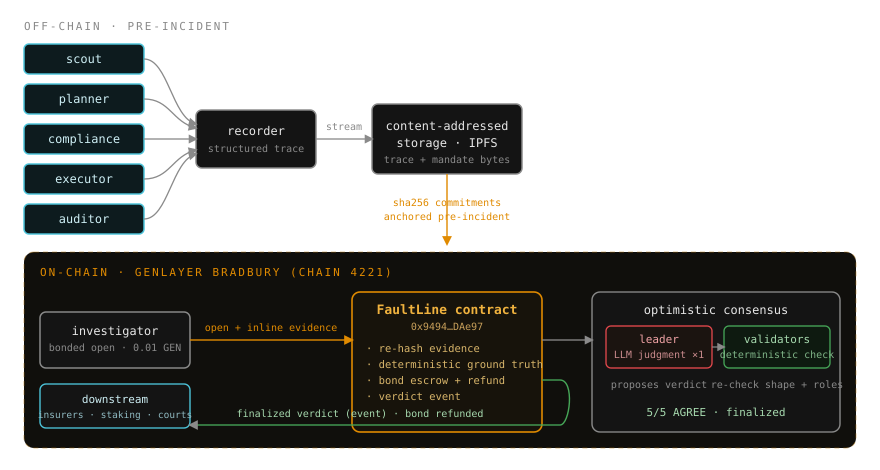

<p align="center">
  
</p>

<h1 align="center">FaultLine</h1>

<p align="center">
  The black-box investigator for multi-agent AI.<br/>
  When a swarm of agents produces a costly failure, FaultLine apportions causal fault across each agent — trustlessly, automatically, from a tamper-proof trace.
</p>

<p align="center">
  <a href="https://github.com/YoneCode/FaultLine"></a>
  <a href="https://x.com/YoneCode"></a>
  
  
  
  
  
</p>

---

## Live on GenLayer Bradbury

FaultLine is deployed and has finalized a real, bonded investigation end-to-end — leader-executed LLM judgment with deterministic validator consensus, unanimous on the first round.

| | |
|---|---|
| **Network** | GenLayer Bradbury (chain id `4221`) |
| **Contract** | [`0x94941FB76b1590CD4835930dF8B955d5718DAe97`](https://explorer-bradbury.genlayer.com/address/0x94941FB76b1590CD4835930dF8B955d5718DAe97) |
| **Investigation tx** | [`0x4793599510a8827397a2472fca5801738f9391fd3f9a1ee926a2d4add93c34e9`](https://explorer-bradbury.genlayer.com/tx/0x4793599510a8827397a2472fca5801738f9391fd3f9a1ee926a2d4add93c34e9) |
| **Outcome** | `ACCEPTED · AGREE · FINISHED_WITH_RETURN` — **5/5 validators, round 0** |
| **Incident** | `inc-2026-08-02-procure-7f3a` |
| **Verdict** | planner **60%** (proximate) · compliance 30% · executor 10% · scout 0% · auditor 0% |
| **Bond** | 0.01 GEN escrowed, **refunded on finalization** |

Every number above is read from the contract by the live UI — nothing is hardcoded into the report.

---

## The problem

Multi-agent swarms now move real money — procurement, trading, logistics, ops. When one produces a costly failure, every vendor's agent blames the others, and the only record is each vendor's own logs. Bilateral courts answer *"did A deliver what B paid for"*; a five-vendor swarm failure is **N-party and causal**, not two-party and contractual. FaultLine is built for that moment: it produces the neutral, technical, on-chain record of *who caused what, by how much*.

## How it works

1. **Record** — each agent wraps its step functions with an open recorder that streams structured trace events to content-addressed storage. Each agent's **mandate** (its declared charter) is hash-committed on-chain *before any incident*, so no one can rewrite their charter after the fact.
2. **Investigate** — a bonded investigation opens with the trace and mandate texts submitted **inline in calldata**. The contract **re-hashes every byte against the pre-anchored commitments deterministically, before any model runs** — tampered evidence is rejected identically on every node. Mechanical ground truth (ordering, handoffs, recorder diversity) is derived in contract code, never asked of the model.
3. **Reach consensus** — the LLM judgment runs **once, on the leader**. Validators don't re-run a live model (provably non-reproducible on Bradbury); they **deterministically verify** the verdict against the authenticated evidence: exact agent set, percentages summing to 100, a zero-gate on "uninvolved," and role labels consistent with the verdict's own numbers. Every honest validator computes the same yes/no, so the run **finalizes instead of deadlocking**.
4. **Settle** — the finalized allocation is written on-chain and emitted as an event, and the bond is refunded. FaultLine moves no money itself: insurers read it to pay claims, staking contracts read it to slash, courts cite it as evidence.

<p align="center">
  
</p>

**Why GenLayer, not a normal LLM call:** validators run genuinely different underlying models (greyboxing), so no AI vendor whose agent is implicated can bias the verdict through friendly weights. FaultLine keeps the model's value — interpreting unstructured traces and natural-language mandates — while keeping the live model call out of the consensus-critical path, which is what makes a subjective judgment finalizable on a deterministic chain.

## The dapp

The web app is a real client of the live contract:

- **Live report** — reads the finalized verdict via `readContract`, renders the per-agent fault bars, the cited trace lines, the pre-anchored mandates, and chain provenance (contract + investigation tx links). No wallet needed to read.
- **Investigate** — connect a wallet (Privy) and run the full flow in the browser: anchor mandates, anchor the trace, then open a bonded investigation and watch it finalize. Users sign with their own wallet; the app never sees a private key.

### Run it

```bash
cd web/app
npm install
npm run dev        # dev server
npm run build      # production build → web/app/dist
```

Environment (frontend): `VITE_PRIVY_APP_ID` (connect-wallet) and `VITE_FAULTLINE_ADDRESS` (defaults to the deployed contract). See `.env.example`.

### Deploy (Cloudflare Pages)

The app is a static Vite build — deploy `web/app/dist`:

- **Build command:** `npm --prefix web/app run build`
- **Output directory:** `web/app/dist`
- **Env vars:** `VITE_PRIVY_APP_ID`, `VITE_FAULTLINE_ADDRESS`

## Develop the contract

```bash
npm run lint:contract     # genvm-lint check
npm run test:contract     # 17 direct-mode tests (genlayer-test)
npm run deploy:bradbury   # deploy to Bradbury (reads key from .env, never printed)
npm run investigate       # anchor evidence + open a bonded investigation
```

The private key is read from `.env` (chmod 600, gitignored) into memory only and is never printed, logged, or sent to the browser.

## Repository layout

```
contracts/faultline.py     # the Intelligent Contract (v0.5.0, deployed)
tests/direct/              # 17 direct-mode tests (genlayer-test)
deploy/                    # deploy + investigate + poll scripts (CLI)
evidence/                  # the real incident bundle (trace.ndjson + 5 mandates + manifest)
web/app/                   # the dapp (React + Vite + genlayer-js + Privy)
assets/architecture.svg    # the diagram above
```

## License

MIT
